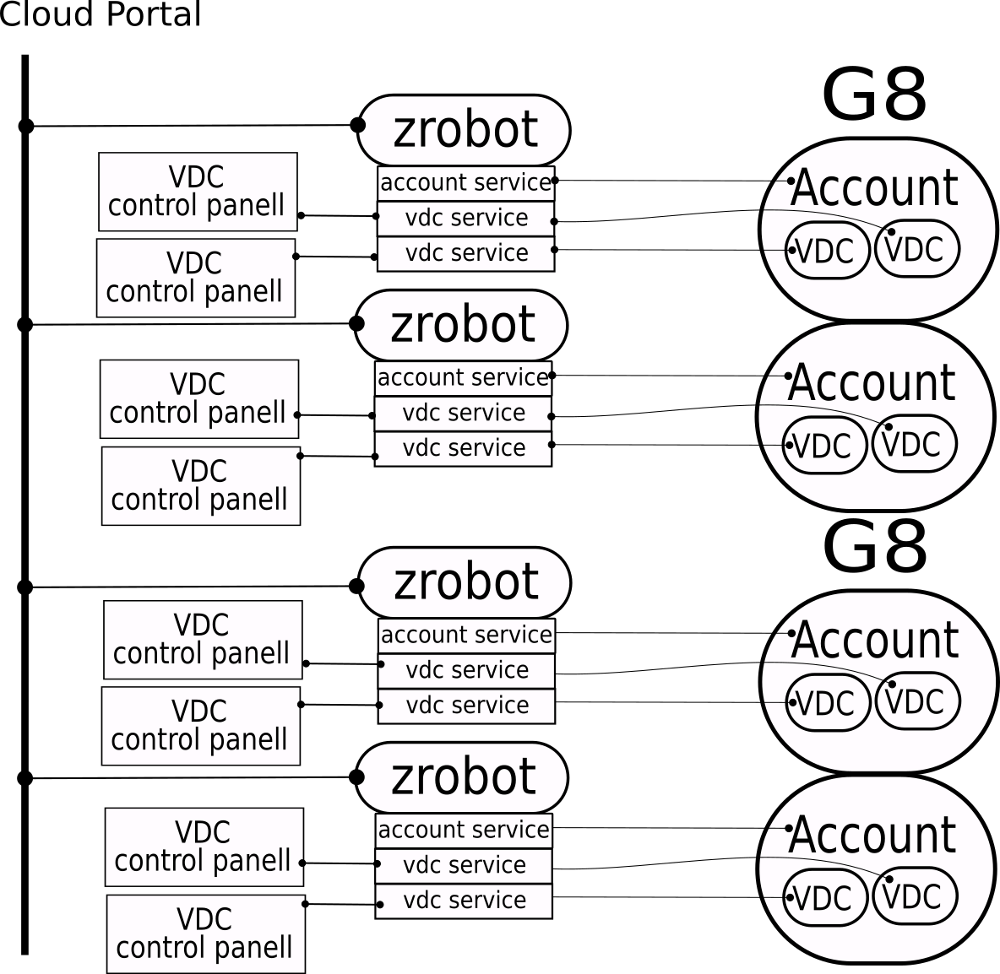

# Communication with `zrobot`

Each [`zrobot`](https://github.com/zero-os/0-robot) exposes REST API.
API requests allow to create/delete/manage services on `zrobot`. Each API call can be addressed to an individual service, as well as contain a blueprint with a list of services to create and list of action to execute on the `zrobot`.
There are several possibilities to send API calls:

  * (recommended) directly with applications like Insomnia or Postman. 
  * (recommended) using `zrobot` DSL. Running `python` scripts Requires `js9` environment (easy to set up and use with `zrobot`, convenient for automation).
  * (not recommended) using `zrobot` CLI. Using `zrobot` CLI tool to send blueprints and control services.

**Design**. Network of `zrobot`'s managing G8s depends on the use case and can be chosen.
We currently assume that a single `zrobot` manages a single account with all VDCs, nodes and disks linked to this account. `zrobot` managing the account can be deployed by another `zrobot` responsible for creating an monitoring account `zrobots`.
All OpenVCloud objects (users, accounts, vdc's, VMs, disks) are managed by services of corresponding type. Each service is an instance of a template, specifically designed to be used by `zrobot`.
Creating, deleting and creating tasks on the services is possible by sending API calls to the zrobot managing an Account.
All actions to OpenVCloud objects have to be done via `zrobot` services, therefore, it is important that both Cloud Portal and VDC control Panel always communicate with `zrobot`, not with G8 directly. This concept is illustrated by the figure bellow.
OpenVCloud templates with examples for communication with robot using DSL and CLI for creating services and managing OpenVCloud objects can be found [here](https://github.com/openvcloud/0-templates). Examples include creating and managing accounts, VDCs, VMs, and disks.

